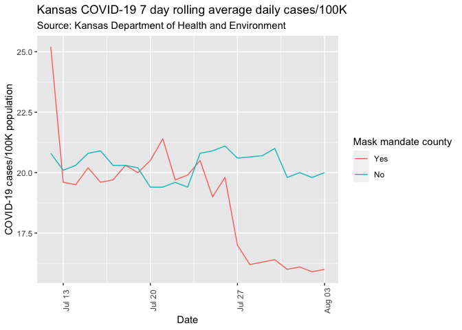

Lab 06 - Conveying the right message through visualisation
================
TEAM NAME

### Load packages and data

``` r
library(tidyverse) 
library(lubridate)
```

### Exercise 1

``` r
mask_data <- tribble(
  ~date, ~count, ~mask,
  "12/7/2020", 25.2, "mask",
  "13/7/2020", 19.6, "mask",
  "14/7/2020", 19.5, "mask",
  "15/7/2020", 20.2, "mask",
  "16/7/2020", 19.6, "mask",
  "17/7/2020", 19.7, "mask",
  "18/7/2020", 20.3, "mask",
  "19/7/2020", 20, "mask",
  "20/7/2020", 20.5, "mask",
  "21/7/2020", 21.4, "mask",
  "22/7/2020", 19.7, "mask",
  "23/7/2020", 19.9, "mask",
  "24/7/2020", 20.5, "mask",
  "25/7/2020", 19, "mask",
  "26/7/2020", 19.8, "mask",
  "27/7/2020", 17, "mask",
  "28/7/2020", 16.2, "mask",
  "29/7/2020", 16.3, "mask",
  "30/7/2020", 16.4, "mask",
  "31/7/2020", 16, "mask",
  "01/8/2020", 16.1, "mask",
  "02/8/2020", 15.9, "mask",
  "03/8/2020", 16, "mask",
  "12/7/2020", 20.8, "no_mask",
  "13/7/2020", 20.1, "no_mask",
  "14/7/2020", 20.3, "no_mask",
  "15/7/2020", 20.8, "no_mask",
  "16/7/2020", 20.9, "no_mask",
  "17/7/2020", 20.3, "no_mask",
  "18/7/2020", 20.3, "no_mask",
  "19/7/2020", 20.2, "no_mask",
  "20/7/2020", 19.4, "no_mask",
  "21/7/2020", 19.4, "no_mask",
  "22/7/2020", 19.6, "no_mask",
  "23/7/2020", 19.4, "no_mask",
  "24/7/2020", 20.8, "no_mask",
  "25/7/2020", 20.9, "no_mask",
  "26/7/2020", 21.1, "no_mask",
  "27/7/2020", 20.6, "no_mask",
  "28/7/2020", 20.65, "no_mask",
  "29/7/2020", 20.7, "no_mask",
  "30/7/2020", 21, "no_mask",
  "31/7/2020", 19.8, "no_mask",
  "01/8/2020", 20, "no_mask",
  "02/8/2020", 19.8, "no_mask",
  "03/8/2020", 20, "no_mask",
)
```

``` r
new_mask <- mask_data %>% 
  mutate(date = dmy(date)) %>% 
  arrange(date) 

unique(new_mask$date)
```

    ##  [1] "2020-07-12" "2020-07-13" "2020-07-14" "2020-07-15" "2020-07-16"
    ##  [6] "2020-07-17" "2020-07-18" "2020-07-19" "2020-07-20" "2020-07-21"
    ## [11] "2020-07-22" "2020-07-23" "2020-07-24" "2020-07-25" "2020-07-26"
    ## [16] "2020-07-27" "2020-07-28" "2020-07-29" "2020-07-30" "2020-07-31"
    ## [21] "2020-08-01" "2020-08-02" "2020-08-03"

``` r
head(new_mask$date)
```

    ## [1] "2020-07-12" "2020-07-12" "2020-07-13" "2020-07-13" "2020-07-14"
    ## [6] "2020-07-14"

### Exercise 2

``` r
#mask_data %>% 
#  mutate(date = as.Date(date)) %>%
  #separate(date, c('date', 'month', 'year'), remove = TRUE,
  #convert = FALSE) %>%
  #arrange(month, date) %>%

new_mask %>% 
ggplot(mapping = aes(x= date, y=count, colour = mask, group = mask)) +
  geom_line() +
  theme(axis.text.x = element_text(angle = 90)) +
  labs(x = "Date",
       y = "COVID-19 cases/100K population",
       title = "Kansas COVID-19 7 day rolling average daily cases/100K",
       subtitle = "Source: Kansas Department of Health and Environment",
       colour = "Mask mandate county") +
  scale_colour_discrete(labels = c("Yes", "No"))
```

<!-- -->

### Exercise 3

The same y-axis makes the difference between with mask and without mask
be shown more obviously. As shown in above visualization, we can say
mask-mandate counties experienced extremely large size of population
getting covid-19 at first but finally decreased to a small population,
while for non-mask-mandate counties, size of covid-19 population was
continuously at about 2000k. So, even if there were more people getting
covid-19 with mask at first, after half month, there were much less
people getting covid-19 with mask than that without mask.

### Exercise 4

*Add your narrative here.*
